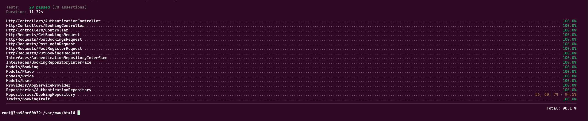

<p align="center"><a href="https://laravel.com" target="_blank"></a></p>

<p align="center">
<a href="https://github.com/laravel/framework/actions"></a>
<a href="https://packagist.org/packages/laravel/framework"></a>
<a href="https://packagist.org/packages/laravel/framework"></a>
<a href="https://packagist.org/packages/laravel/framework"></a>
</p>

## Application Boot

```
cd cavu-api
```
```
cp .env.example .env
```
```
docker-compose up -d
```
```
docker-compose exec app composer install
```
```
docker-compose exec app php artisan key:generate
```

## Testing

```
docker-compose exec -it app bash
```
```
XDEBUG_MODE=coverage php artisan test --coverage
```


## API

```
docker-compose exec app php artisan migrate:fresh --seed
```
---
### Register
#### Request
```
curl --location 'http://127.0.0.1/api/register' \
--form 'email="test.user@example.com"' \
--form 'password="password123"' \
--form 'name="test user"'
```
##### Response
```
{
    "status": "success"
}
```
---
### Login
#### Request
```
curl --location 'http://127.0.0.1/api/login' \
--form 'email="test.user@example.com"' \
--form 'password="password123"'
```
##### Response
```
{
    "status": "success",
    "token": "1|cPSv8mFTjIYAcRZXRAmcLOmMYSoACqH8mmQb3NQvdbf69ff3"
}
```
---
### Logout
#### Request
```
curl --location --request POST 'http://127.0.0.1/api/logout' \
--header 'Authorization: Bearer 1|6NcxCEaItg3V5XhCaQabhzI8rYsNDwVKSg9jcKX822b0635d'
```
##### Response
```
{
    "status": "success"
}
```
---
### Get all available spaces - no login required
#### Request
```
curl --location 'http://127.0.0.1/api/bookings?start_at=2025-02-23&end_at=2025-03-28'
```
##### Response
```
{
    "status": "success",
    "data": [
        {
            "date": "2025-02-23",
            "available": 10,
            "price": "4"
        },
        ...
        {
            "date": "2025-03-28",
            "available": 10,
            "price": "1"
        }
    ]
}
```
---
### Create the booking
#### Request
```
curl --location 'http://127.0.0.1/api/bookings' \
--header 'Content-Type: application/json' \
--header 'Authorization: Bearer 2|8Kp4l8lu2CSPQmFKFhoOKW31o3aHYxFcqEvBMq7P025e95a0' \
--data '{
    "start_at": "2025-02-20",
    "end_at": "2025-02-25"
}'
```
##### Response
```
{
    "status": "success"
}
```
---
### To see created booking details
#### Request
```
curl --location 'http://127.0.0.1/api/bookings/details' \
--header 'Authorization: Bearer 2|8Kp4l8lu2CSPQmFKFhoOKW31o3aHYxFcqEvBMq7P025e95a0'
```
##### Response
```
{
    "status": "success",
    "message": "",
    "data": {
        "id": 1,
        "user_id": 6,
        "place_id": 1,
        "start_at": "2025-02-20",
        "end_at": "2025-02-25",
        "deleted_at": null,
        "created_at": "2025-02-16T16:24:25.000000Z",
        "updated_at": "2025-02-16T16:24:25.000000Z",
        "place": {
            "id": 1,
            "name": "eos",
            "created_at": "2025-02-16T16:14:11.000000Z",
            "updated_at": "2025-02-16T16:14:11.000000Z"
        }
    }
}
```
---
### Update active booking
#### Request
```
curl --location --request PUT 'http://127.0.0.1/api/bookings' \
--header 'Content-Type: application/json' \
--header 'Authorization: Bearer 2|8Kp4l8lu2CSPQmFKFhoOKW31o3aHYxFcqEvBMq7P025e95a0' \
--data '{
    "start_at": "2025-02-21",
    "end_at": "2025-02-26"
}'
```
##### Response
```
{
    "status": "success"
}
```
---
### Delete active booking
#### Request
```
curl --location --request DELETE 'http://127.0.0.1/api/bookings' \
--header 'Authorization: Bearer 2|8Kp4l8lu2CSPQmFKFhoOKW31o3aHYxFcqEvBMq7P025e95a0'
```
##### Response
```
{
    "status": "success"
}
```
